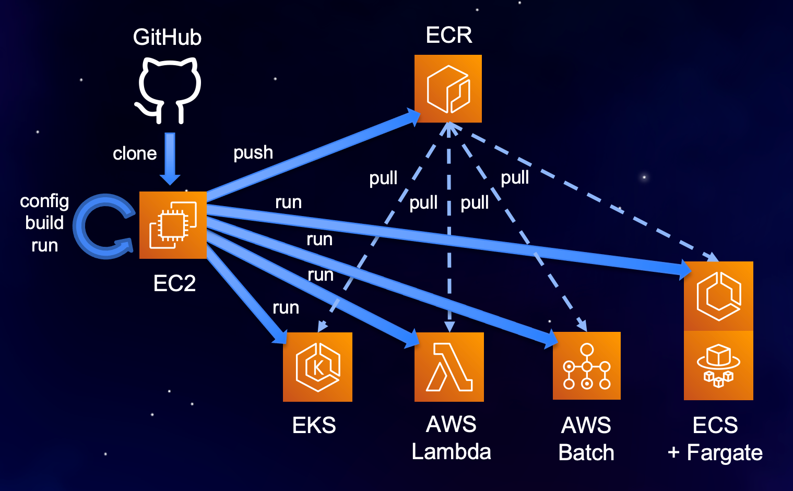

# AWS DevOps for Docker (aws-do-docker)

This project provides a simple pattern for building and deployment of Docker containers to AWS. It can be used "as is" to build and run a sample container, or can be customized and used to build, test, and deploy containerized microservices, jobs, or serverless functions.

Containers built using this project can be run locally or on [EC2](https://aws.amazon.com/ec2), [ECS](https://aws.amazon.com/ecs), [EKS](https://aws.amazon.com/eks), [Fargate](https://aws.amazon.com/fargate), [AWS Batch](https://aws.amazon.com/batch), or [AWS Lambda](https://aws.amazon.com/lambda) just by configuring the target orchestrator ( [`./config.sh TO`](config.sh) ) and executing [`./run.sh`](run.sh).

<div align="center"></div>
<div align="center">Fig. 1 - Container workflow</div>

## Prerequisites
The following are minimum requirements to use this project:
* [`bash` compatible Unix shell](https://en.wikipedia.org/wiki/Unix_shell) - required for running control scripts 
* [`Docker`](https://docs.docker.com/get-docker/) - Docker Desktop or Docker for Linux v 19.03 or newer
* [`aws-cli v2`](install/install-aws-cli.sh) - install using script [`install/install-aws-cli.sh`](install/install-aws-cli.sh) 
    * `aws configure` - provide credentials for your aws command line client

Additional requirements are determined by your selection of a target orchestrator (TO). Install the tools corresponding to each container orchestrator you plan to use as described below:    
* [`docker-compose`](install/install-docker-compose.sh) - required when running in Docker Compose or Docker Swarm
* [`ecs-cli`](install/install-ecs-cli.sh) - required when deploying to ECS
    * [`ssm-plugin`](install/install-ssm-plugin.sh) - optional, needed to enable exec into container running on ECS
* [`kubectl`](install/install-kubectl.sh) - required when deploying to EKS
    * ~/.kube/config - it is assumed that a Kubernetes cluster exists and the local host is configured to access it via kubectl  

## Using the project
To use this repository without modification, just clone it from Git, then execute the [`./build.sh`](./build.sh) script. To verify that the sample container works as expected, execute [`./run.sh`](./run.sh), then [`./test.sh`](./test.sh) and [`./logs.sh`](./logs.sh).

The following logs indicate the container works correctly:
```
Showing logs from container parrot-docker on docker ...
Container-Root/startup.sh executed
Thu May 13 05:02:41 UTC 2021
[2021-05-13 05:02:41 +0000] [8] [INFO] Running on http://0.0.0.0:80 (CTRL + C to quit)
Received healthcheck request
Returning {'Status': 'Healthy'}
Received say request: Nice demo!
Returning {'Message': 'Nice demo!'}
```
Execute the [`./stop.sh`](./stop.sh) script to remove the container.

To use this repository as a starting point for your own container project, clone the repo and name it accordingly. Then execute [`./config.sh -i`](./config.sh) to review and set the basic project settings interactively. For each setting, the current value will be displayed. You may type a new value, or just press `Enter` to preserve the current one.

We recommend developing changes locally and testing them on a target orchestrator that runs the container on the local machine before deploying it elsewhere. Local target orchestrators are `docker`,`compose`,`lambdalocal`,and `batchlocal`.

To customize your container, iteratively modify or add files in the `Conteiner-Root` folder. The content of this folder is added to the root of your Docker image. Use [`./build.sh`](build.sh) to rebuild your container image, [`./run.sh`](run.sh), [`./status.sh`](status.sh), [`./exec.sh`](exec.sh), [`./test.sh`](test.sh), [`./logs.sh`](logs.sh) to start and interact with the container, and [`./stop.sh`](stop.sh) to stop and remove it. For more details, please see the "Customizing the project"(#customizing-the-project) section.

When you'd like to deploy the container to a remote environment, push the container image to a container registry by executing the [`./login.sh`](login.sh) and [`./push.sh`](push.sh) scripts, then configure the target orchestrator where you would like to run the container as follows:

```
local:~/environment/demo $ ./config.sh TO

## Target orchestrator TO=docker|compose|ecs|swarm|kubernetes|eks|lambda|batchlocal|batch
## docker - choose when running locally or on ec2
## compose - choose when running locally, on ec2
## ecs - choose when running on ecs with or without Fargate
## swarm - choose when running on a docker swarm
## kubernetes - choose when running on a local, remote Kubernetes cluster or EKS, with or without Fargate
## lambdalocal - choose when developing and testing an AWS Lambda container locally
## lambda - choose when running containerized function on AWS Lambda
## batchlocal - choose when running containerized jobs locally
## batch - choose when running containerized jobs on AWS Batch
export TO=docker

Set TO [ docker ] to: 
ecs

New value:
export TO=ecs
```

For each of the target orchestrators listed above, you may use the same sequence of commands:

[`./config.sh TO`](config.sh), [`./run.sh`](run.sh), [`./status.sh`](status.sh), [`./test.sh`](test.sh), [`./logs.sh`](logs.sh), [`./stop.sh`](stop.sh)

The workflow on each target orchestrator looks similar to the demo below:

<div align="center"></div>
<div align="center">Fig. 2 - Demo - running and testing sample container on EC2 and EKS</div>

To run this project on distributed AWS container orchestrators, such as [ECS](https://aws.amazon.com/ecs), [Lambda](https://aws.amazon.com/lambda), [Batch](https://aws.amazon.com/batch), and [EKS](https://aws.amazon.com/eks), the credentials provided to the AWS CLI must have sufficient privileges. See the "[Advanced settings](#advanced-settings)" section for more information on how to enable `Fargate` for target orchestrators `ecs`, `batch`, or `kubernetes`.

## Customizing the project

### Project structure

The project has the following structure, which can be reused or extended for containerizing other microservices/apps, functions, or jobs.


```
.
├── build.sh
├── config.sh
├── Container-Root
│   ├── app
│   ├── function
│   ├── job
│   ├── requirements.txt
│   ├── setup.sh
│   ├── startup.sh
│   ├── test1.sh
│   └── test2.sh
├── Dockerfile
├── Dockerfile-lambda
├── docs
│   └── img
├── exec.sh
├── install
│   ├── install-aws-cli.sh
│   ├── install-docker-compose.sh
│   ├── install-ecs-cli.sh
│   ├── install-kubectl.sh
│   └── install-ssm-plugin.sh
├── LICENSE
├── login.sh
├── logs.sh
├── pull.sh
├── push.sh
├── README.md
├── run.sh
├── status.sh
├── stop.sh
├── test.sh
└── to
    ├── compose
    ├── kubernetes
    └── lambda
```

The main folder contains the configuration file [`.env`](.env), the control scripts `*.sh` and Dockerfiles.
The install folder contains scripts to facilitate installation of dependent tools as needed, based on your target orchestrator.
The `Container-Root` folder hosts the content that goes inside your container. Files and folder structures from this location get copied into the root of the container image. Implementation of different container functionality typically involves adding files or modifying content within this folder.

Files that typically get modified in the `Container-Root` folder include:
* [`setup.sh`](Container-Root/setup.sh) - this file gets executed at container build time and is responsible for installing software within your container as needed.
* [`startup.sh`](Container-Root/startup.sh) - this file gets executed as a command at start time and is responsible for launching the main process in your container.
* `test*.sh` - unit tests to verify your container works as expected
* `app/*` - application files for service containers
* `function/*` - function code, startup and test files for lambda-based containers 
* `job/*` - job code, startup and test files for containerized jobs

To customize the deployment of your container for one of the supported target orchestrators, you can modify the content of the corresponding `to/<orchestrator>/template` folder. You can use the environment variable names that are defined in [`.env`](.env) within your template files. The environment variables get substituted at launch time and produce the files placed in the corresponding `to/<orchestrator>/app` folder.

### Control scripts

The project contains the following scripts:

* [`config.sh`](config.sh) - configure project settings
* [`build.sh`](build.sh) - build the container image
* [`test.sh`](test.sh) - run container unit tests
* [`push.sh`](push.sh) - push the container image to a registry
* [`pull.sh`](pull.sh) - pull the container image from a registry
* [`run.sh [cmd]`](run.sh) - run the container, passing an argument overrides the default command
* [`status.sh`](status.sh) - show container status - running, exited, etc.
* [`logs.sh`](logs.sh) - tail container logs
* [`exec.sh [cmd]`](exec.sh) - open a shell or execute a specified command in the running container

### Configuration 

All settings in the project are centralized in the [`.env`](.env) configuration file. The default settings can be used without any modifications to build and run a sample Docker container locally.

Configuration is managed through the [`./config.sh`](config.sh) script.

```
Usage: ./config.sh [setting] [value]

   ./config.sh --help        - display usage information
   ./config.sh -i            - edit selected settings interactively
   ./config.sh               - edit configuration file
   ./config.sh setting       - edit specified setting interactively
   ./config.sh setting value - set the specified setting to the provided value
```

#### Sections

The [`.env`](.env) file contains the following sections:
* Proxy settings - if you are working behind a corporate proxy, these settings allow your container to connect to the Internet.
* Project settings - project-wide settings to specify Target Orchestrator (TO), verbosity, debug flag, etc.
* Docker image settings - define image name, docker registry, build options, etc
* Target orchestrator settings - common and TO specific settings in corresponding subsections

#### Basic settings
To configure basic settings for the project interactively, execute [`./config.sh -i`](config.sh). You will be asked to set the following:
* `TO`=docker|compose|ecs|swarm|kubernetes|lambdalocal|lambda|batchlocal|batch
* `BASE_IMAGE_PATH` - base image from which your project's image will be built
* `REGISTRY` - docker registry to which your image will be pushed
* `IMAGE_NAME` - name of your image
* `VERSION` - your docker image version tag

#### Advanced settings
* `PORT_INTERNAL` - if your container runs a server process, this is the port that process listens on inside the container
* `PORT_EXTERNAL` - if the container listens on an internal port, this is the corresponding port exposed outside of the continer 
* `VOLUME_PATH_EXTERNAL` - external path that you wish to mount into the container, used primarily in local environments
* `VOLUME_PATH_INTERNAL` - path inside the container that the external volume is mounted on
* `REGION` - AWS region to use for deploying your container
* `ECS_LAUNCH_TYPE`=EC2|FARGATE - select whether to use EC2 or FARGATE when deploying container to ECS
* `BATCH_COMPUTE_ENVIRONMENT_TYPE`=EC2|FARGATE - select whether to use EC2 or FARGATE when deploying to AWS Batch
* `NAMESPACE` - configure EC2 managed or FARGATE profile namespace when deploying container to EKS

For reviewing and editing of all possible project settings, execute [`./config.sh`](config.sh) to open the [`.env`](.env) file in a text editor.

#### GPU Support

To run GPU workloads, the following additional settings need to be defined depending on your target orchestrator.

EC2/docker:
* The EC2 instance on which the container runs should be provisioned with GPU resources. Please refer to the Accelerated Computing section of the [Amazon EC2 Instance Types](https://aws.amazon.com/ec2/instance-types/) page for selection of the desired GPU type.
* For Docker to make GPUs available within the container, the --gpus option must be specified in the docker run command. To achieve that, add the option to the `RUN_OPTS` setting in the configuration file `.env`. Examples:  `--gpus all` or `--gpus 0`

ECS:
* [Provision the ECS cluster](https://docs.aws.amazon.com/AmazonECS/latest/userguide/create_cluster.html) with [EC2 launch type](https://docs.aws.amazon.com/AmazonECS/latest/developerguide/launch_types.html#launch-type-ec2) through the AWS console and specify the desired GPU instance type
* Set the `ECS_MANAGE_CLUSTER` value to `false` in the configuration file `.env`. This will allow the project to use an existing ECS cluster, instead of creating one
* Set the `ECS_CLUSTER` value to the name of your GPU-enabled ECS cluster
* Modify the ECS task template [to/compose/template/ecs-params-EC2.yaml](to/compose/template/ecs-params-EC2.yaml) to include a GPU resource requirement `gpu: 1` as described in the [Amazon ECS parameters schema](https://docs.aws.amazon.com/AmazonECS/latest/developerguide/cmd-ecs-cli-compose-ecsparams.html)

Batch:
* [Provision the AWS Batch Compute Environment using EC2 resources](https://docs.aws.amazon.com/batch/latest/userguide/create-compute-environment.html#create-compute-environment-managed-ec2) through the AWS console and specify the desired GPU instance type
* Set the `BATCH_MANAGE_COMPUTE_ENVIRONMENT` value to `false` in the configuration file `.env`. This will allow the project to use an existing compute environment, instead of creating one
* Set the `BATCH_COMPUTE_ENVIRONMENT_NAME` value to the name of your GPU-enabled compute environment
* Edit script [`./run.sh`](run.sh) (~line 223), modify variable `BATCH_CONTAINER_PROPERTIES` to include `resourceRequirements=\"[{type=GPU,value=1}]\"`. For more information about resourceRequirements and other job definition settings, refer to the [register-job-definition](https://docs.aws.amazon.com/cli/latest/reference/batch/register-job-definition.html) API documentation

EKS/kubernetes:
* In your EKS cluster [provision a node group](https://docs.aws.amazon.com/eks/latest/userguide/create-managed-node-group.html) of instances with the desired GPU type
* Modify the deployment template [`to/kubernetes/template/020-deployment.yaml`](to/kubernetes/template/020-deployment.yaml), uncomment lines 32-36, specifying container resource limit `nvidia.com/gpu:`, and set the desired number of GPUs for your container.

## License
This repository is released under the MIT-0 License. See the [LICENSE](LICENSE) file for details.

## References

* [Docker](https://docker.com)
* [Docker Compose](https://docs.docker.com/compose/)
* [Docker Swarm](https://docs.docker.com/engine/swarm/)
* [Kubernetes](https://kubernetes.io)
* [Amazon Web Services (AWS)](https://aws.amazon.com/)
* [Amazon EC2](https://aws.amazon.com/ec2)
* [Amazon EC2 Instance Types](https://aws.amazon.com/ec2/instance-types/)
* [AWS Lambda](https://aws.amazon.com/lambda/)
* [Amazon Elastic Container Service (ECS)](https://aws.amazon.com/ecs)
* [Amazon Elastic Kubernetes Service (EKS)](https://aws.amazon.com/eks)
* [AWS Batch](https://aws.amazon.com/batch)
* [AWS Fargate](https://aws.amazon.com/fargate)
* [Depend on Docker Project](https://github.com/iankoulski/depend-on-docker)
* [DockerCon 2021 Presentation](https://www.docker.com/dockercon-live/2021/content/Videos/qYmjYNgD27hS8559G)
